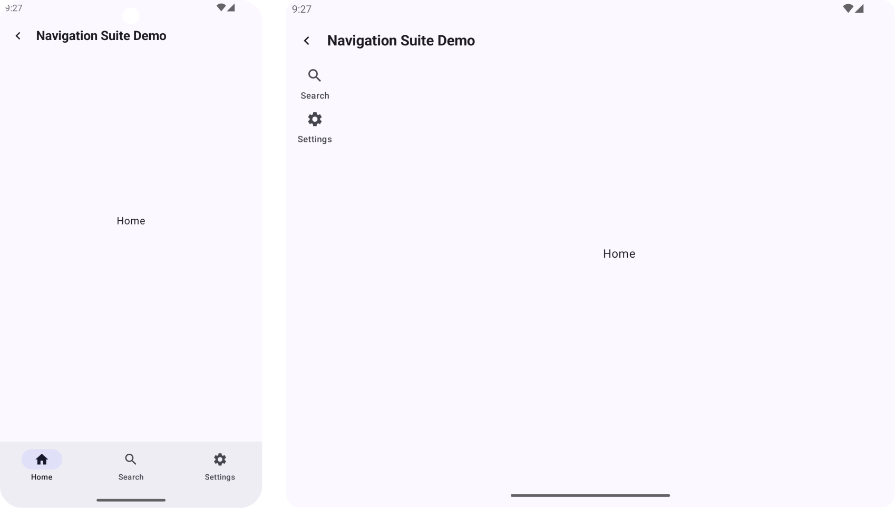

# Foldables Demo

This project is a playground for exploring and showcasing specialized components that support different screen sizes on foldable devices.

## Official Documentation
1. [Material Guide](https://m3.material.io/foundations/layout/understanding-layout/overview) - entire `Layout` section
2. [Different Screens Compatibility Guide](https://developer.android.com/guide/practices/compatibility) - `Device Compatibility`, `Large Screens`
3. [Adaptive Layout Guide](https://developer.android.com/develop/ui/compose/layouts/adaptive) - `Do's and Don'ts`, entire `Adaptive Layout` section

## Libraries
```kotlin
// For the core building blocks for building adaptive UI, 
// including computing the window size class and the current posture
implementation("androidx.compose.material3.adaptive:adaptive:1.0.0")

// For standalone navigators for the multi-pane scaffold layouts
implementation("androidx.compose.material3.adaptive:adaptive-navigation:1.0.0")

// NavigationSuiteScaffold component
implementation("androidx.compose.material3:material3-adaptive-navigation-suite:1.3.0")
```

## Demos
1. **Activity Lifecycle Demo**  
   Demonstrates lifecycle method calls at runtime.

   

2. **Expandable Content**  
   Shows how to adapt the layout based on screen width using `androidx.compose.material3.adaptive.WindowAdaptiveInfo`.

   

3. **ListDetailPaneScaffold**  
   Demonstrates the [**NavigableListDetailPaneScaffold**](https://m3.material.io/foundations/layout/canonical-layouts/list-detail) component.
    
   **ListDetailPaneScaffold** is a composable that simplifies the implementation of the list-detail pattern in your app. A list-detail scaffold can consist of up to three panes: a list pane, a detail pane, and an optional extra pane. [(Documentation)](https://developer.android.com/develop/ui/compose/layouts/adaptive/list-detail)

   

5. **Supporting Pane**  
   Demonstrates the [**NavigableSupportingPaneScaffold**](https://m3.material.io/foundations/layout/canonical-layouts/supporting-pane) component.
   
   The supporting pane layout focuses user attention on your app's main content while also displaying relevant supporting content. SupportingPaneScaffold also consists of up to three panes: a main pane, a supporting pane, and an optional extra pane. [(Documentation)](https://developer.android.com/develop/ui/compose/layouts/adaptive/build-a-supporting-pane-layout)

   

6. **Navigation Suite**  
   Demonstrates how to implement navigation for different screen sizes:
    - **Navigation Drawer** for wide screens
    - **Navigation Rail** for medium-width screens
    - **Bottom Navigation Bar** for small screens \
      
   Implemented using the **NavigationSuiteScaffold** component. [(Documentation)](https://developer.android.com/develop/ui/compose/layouts/adaptive/build-adaptive-navigation)

   

## Tips
1. When folding/unfolding a foldable device, it's similar to a configuration change, so consider the activity lifecycle.
2. Remember the activity lifecycle in [multi-window mode](https://developer.android.com/develop/ui/compose/layouts/adaptive/support-multi-window-mode#lifecycle).
3. If your app uses the camera, consider the lifecycle in [multi-window mode](https://developer.android.com/develop/ui/compose/layouts/adaptive/support-multi-window-mode#exclusive_resource_access).
4. Store as much data as possible in a ViewModel or with `rememberSaveable`.
5. Test your app in multi-window mode to ensure important UI elements aren’t obstructed.
6. Do not set `android:resizeableActivity="false"`; this only works for API levels lower than 24.
7. Don’t lock activity orientation. It causes letterboxing on large screens and incompatible window sizes, reducing discoverability on Google Play for tablets, foldables, and ChromeOS. [(Details)](https://developer.android.com/develop/ui/compose/layouts/adaptive/adaptive-dos-and-donts#orientation)
8. Set the `windowBackground` to the appropriate color because if the app hangs while rendering during a configuration change, the unrendered parts will be colored accordingly.
9. Always use the activity context instead of the application context when accessing display information.
10. Use `FLAG_ACTIVITY_LAUNCH_ADJACENT` to open content in a split-screen window next to the current one.
11. Avoid placing interactive elements at the center of the screen, as they may not be accessible in the half-opened state.
12. Keep in mind that some foldable devices have **physical dividers** (hinges) between displays. Ensure to check for the presence of hinges using `currentWindowAdaptiveInfo().windowPosture.hingeList` and adjust your UI accordingly.
    
    [+ Additional Tips](https://medium.com/fenrir-inc/notes-on-supporting-android-foldables-2cc89bfa86fe)

## Other Samples
- [JetNews by Compose](https://github.com/android/compose-samples/tree/master/JetNews) - Wide screen support without ready-made components.
- [Reply by Jetpack Compose](https://github.com/android/compose-samples/tree/master/Reply) - Custom navigation without NavigationSuite.
